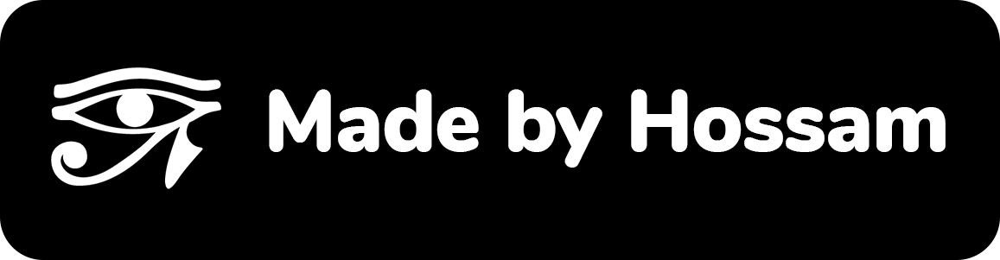

# nova-cpp

  
 

This project is a C++ implementation of [Nova](https://github.com/hussamsh/Nova) a cryptography application based on chaotic maps. It encrypts at three to five times as fast as the original implementation in javascript.

This application runs from the terminal and has three maps implemented
* Logistic map
* Double humped map
* Hénon map

Uses `openCV` for pixel manupliation.

